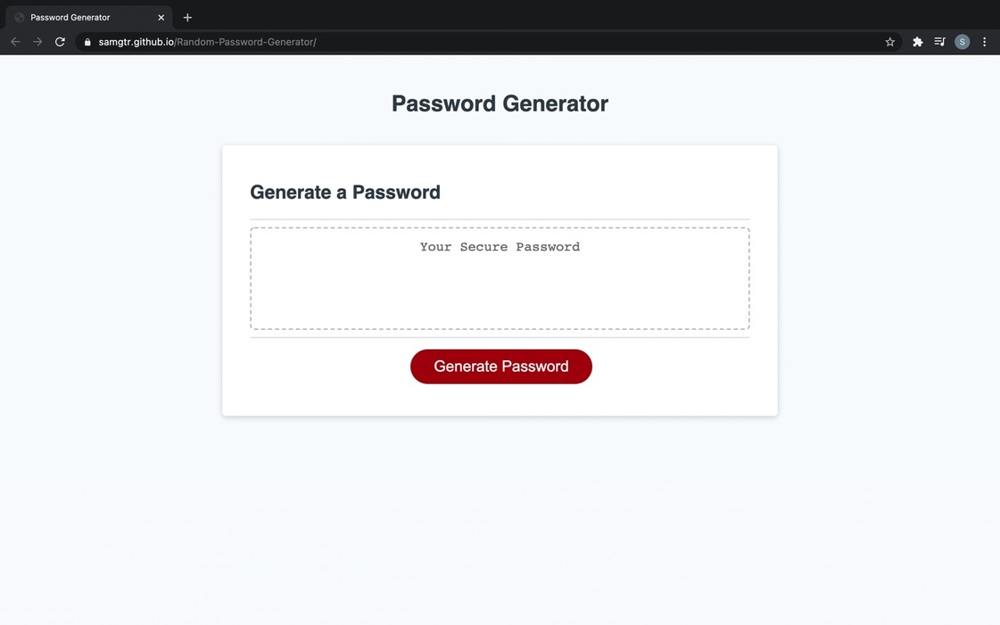
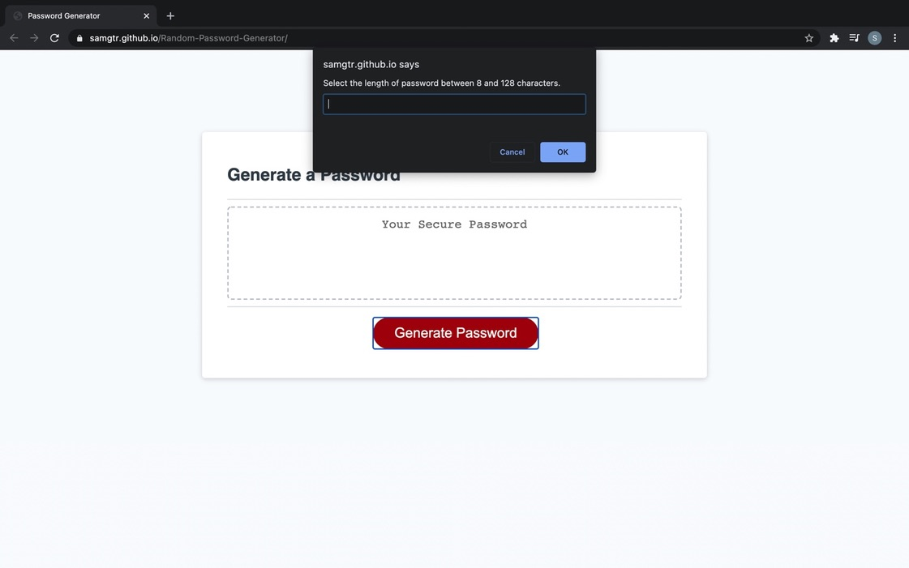
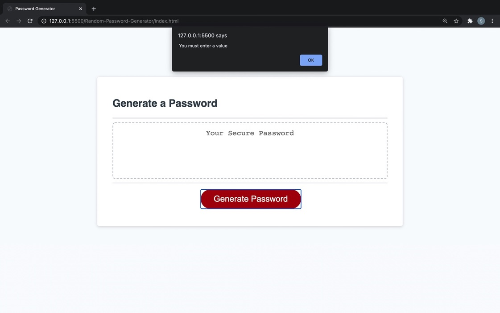
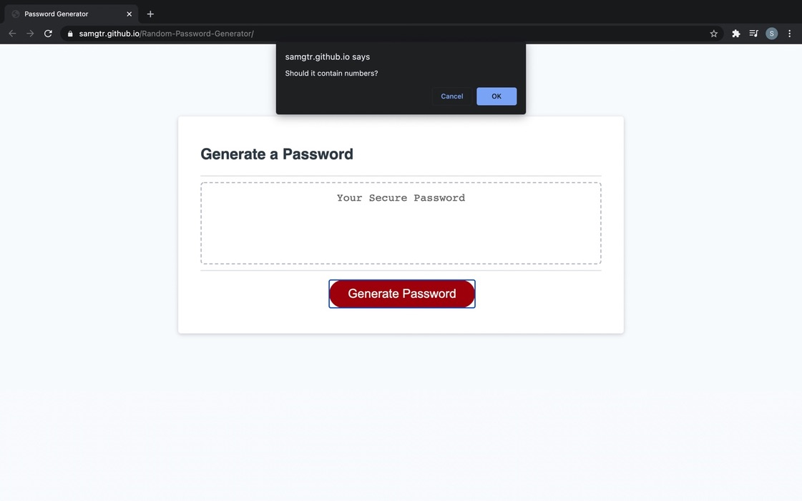
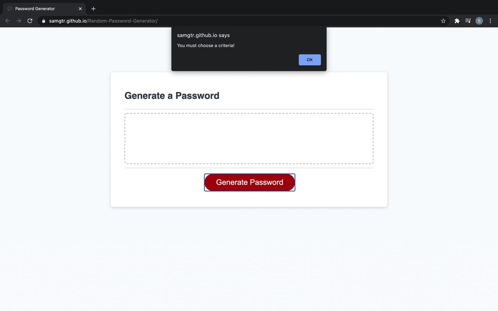
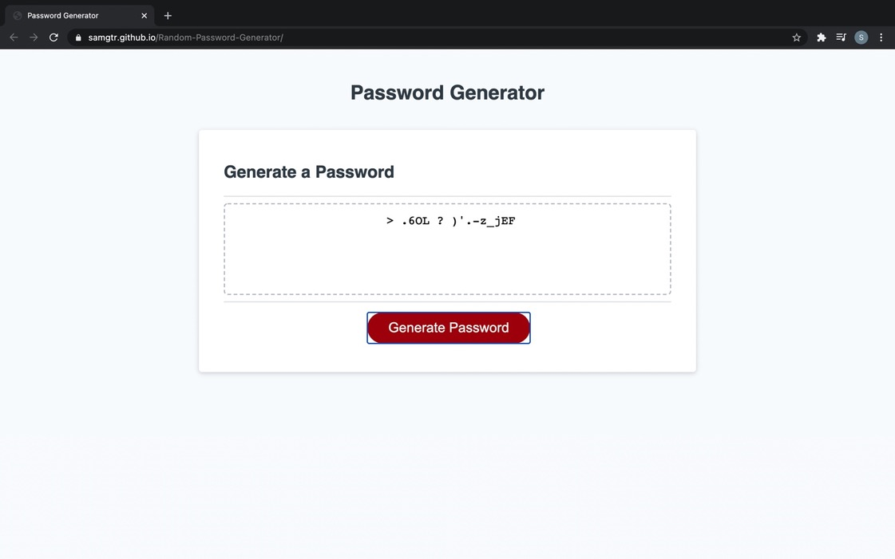

# 03 JavaScript: Password Generator
This web application is developed as Week-3 Homework requirement.  
This application, designed using javascript, generates random password based on the criterias selected.

## Installation

- Git clone the application from : https://github.com/SamGTR/Random-Password-Generator.git
- Navigate to the index.html.
- Open the index.html file with any web browser.

## Description

The starter code was given for this projects and it was expected to develop full application for generating random password. HTML, CSS and Javascript files are created to make this application generate password.
- On running the application, user is presented with browser layout with text-box and a button to generate a password.

- When the user clicks the "Generate Password" button, application prompts the user to enter the length of the password between 8 to 128 characters.

- If the user does not enter the length of password and click OK or Cancel, then it will show an alert to enter the password length.

- Once user enters the password length, the application will ask to choose criterias like password containing number, special characters, uppercase and lower case.

- If user does not select any of the criterias then, the application will show alert for chosing a criteria.

- If user enters proper password length and selects related criterias, then a password of selected length and criterias is displayed in the text-area.

## Technology

The web application is developed using HTML, CSS and Javascript files. 
- The HTML file contains various divs with classes and IDs and also button for generating password.
- The CSS file includes features like media query for 690px and 500 px. The images on the webpage are located in images folder.
- The Javascript file consists of eventlistener for noticing clicks, then prompts, alerts and confirms for informing user to take an action.

## Links

Following is the link to the Password Generator application:  
https://samgtr.github.io/Random-Password-Generator/

Following is the link to the Github repository for Password Generator application:  
https://github.com/SamGTR/Random-Password-Generator

## License

MIT